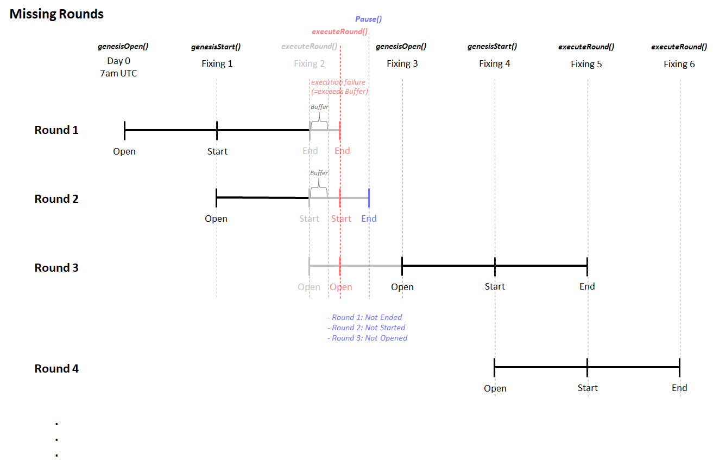

# BaseVol: On Chain Short-term Vol market

## Description

Digital option market for crypto trade on 1 day price change

## 🚨 Important Notice - Diamond Structure Migration

**This project has been restructured using the Diamond Pattern!**

### New Structure (After 2025-10-02)

```
contracts/
├── diamond-common/      # Common Diamond infrastructure
├── basevol/            # BaseVol Diamond (new structure)
└── genesis-vault/      # GenesisVault Diamond

scripts/
├── basevol/            # BaseVol deployment and upgrade
└── genesis-vault/      # GenesisVault deployment and upgrade
```

### ⚠️ Mainnet Contract Upgrade

To upgrade the existing BaseVol Diamond deployed on mainnet:

```bash
# 1. Verify diamond state (optional)
npx hardhat run --network base_sepolia scripts/basevol/verify-diamond-state.ts

# 2. Verify compatibility (local - optional)
npx hardhat run scripts/basevol/verify-compatibility.ts

# 3. Test on Sepolia
npx hardhat run --network base_sepolia scripts/basevol/upgrade-basevol-facet.ts

# 4. Mainnet upgrade
npx hardhat run --network base scripts/basevol/upgrade-basevol-facet.ts
```

📚 **For more details**: See [scripts/basevol/README.md](./scripts/basevol/README.md) and [scripts/basevol/OWNER_UPGRADE_GUIDE.md](./scripts/basevol/OWNER_UPGRADE_GUIDE.md)

---

## Documentation

## Oracle Price Feed (Pyth)

### BTC/USD

- Base: `0xe62df6c8b4a85fe1a67db44dc12de5db330f7ac66b72dc658afedf0f4a415b43`

### ETH/USD

- Base: `0xff61491a931112ddf1bd8147cd1b641375f79f5825126d665480874634fd0ace`

## Deployment

### Operation

When a round is started, the round's `lockBlock` and `closeBlock` would be set.

`lockBlock` = current block + `intervalBlocks`

`closeBlock` = current block + (`intervalBlocks` \* 2)

## Kick-start Rounds

The rounds are always kick-started with:

```
genesisOpenRound()
(wait for x blocks)
genesisStartRound()
(wait for x blocks)
executeRound()
```

## Continue Running Rounds

```
executeRound()
(wait for x blocks)
executeRound()
(wait for x blocks)
```

## Resuming Rounds

After errors like missing `executeRound()` etc.

```
pause()
(Users can't participant, but still is able to withdraw)
unpause()
genesisOpenRound()
(wait for x blocks)
genesisStartRound()
(wait for x blocks)
executeRound()
```

## Common Errors

Refer to `test/BaseVol.test.ts`

## Architecture Illustration

### Normal Operation


### Missing Round Operation


