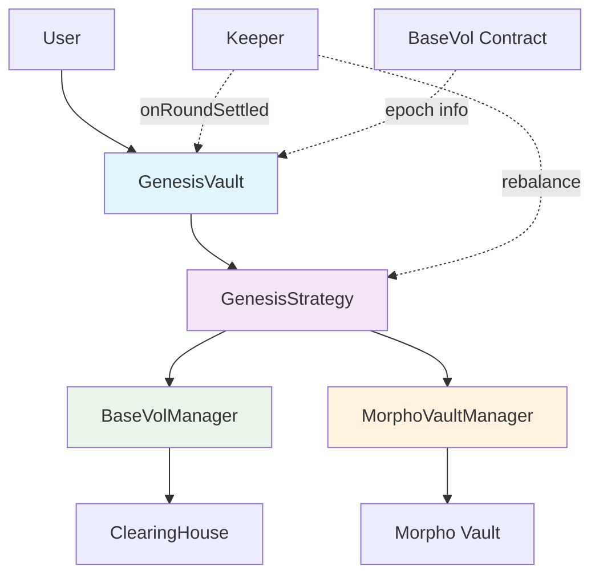
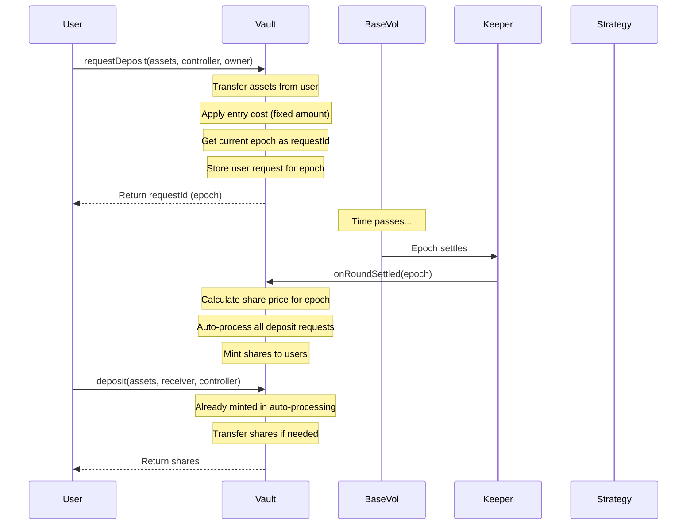
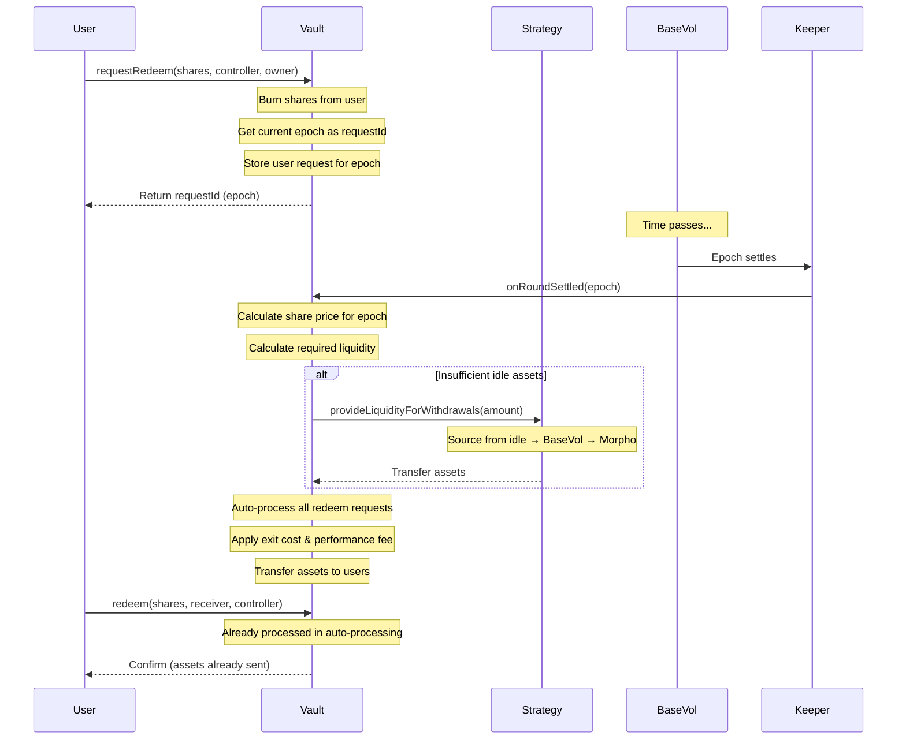

# Genesis Vault ERC7540 System Architecture

## 1. Overview

The Genesis Vault system is an **ERC7540-compliant asynchronous DeFi Vault** integrated with the BaseVol protocol's epoch-based settlement system. The architecture follows a modular design pattern with clear separation of concerns:

```
GenesisVault (ERC7540) → GenesisStrategy → [BaseVolManager, MorphoVaultManager] → External Protocols
```

### Key Features

- **ERC7540 Standard**: Full implementation of asynchronous deposit/redeem with request-claim pattern
- **Epoch-Based Settlement**: Integrated with BaseVol's epoch system for synchronized operations
- **Automated Processing**: Keeper-driven automatic settlement and user request processing
- **WAEP Performance Fees**: Weighted Average Entry Price based performance fee calculation
- **Fixed Entry/Exit Costs**: Predictable fee structure with fixed-amount costs
- **Multi-Protocol Strategy**: Intelligent asset allocation across BaseVol and Morpho

### Architecture Diagram



## 2. Core Contracts

### 2.1 GenesisVault (Main Vault Contract)

**Location**: `contracts/core/vault/GenesisVault.sol`

**Inheritance**: `GenesisManagedVault`, `IERC7540`

**Primary Responsibilities**:

- ERC7540 asynchronous deposit/redeem operations
- Epoch-based request management and settlement
- Integration with BaseVol epoch system
- Automated request processing
- Operator and keeper management

**Core Functions**:

**ERC7540 Request Functions**:

- `requestDeposit(assets, controller, owner)`: Submit async deposit request (returns epoch as requestId)
- `requestRedeem(shares, controller, owner)`: Submit async redeem request (returns epoch as requestId)
- `pendingDepositRequest(requestId, controller)`: View pending deposit amount
- `pendingRedeemRequest(requestId, controller)`: View pending redeem amount
- `claimableDepositRequest(requestId, controller)`: View claimable deposit amount
- `claimableRedeemRequest(requestId, controller)`: View claimable redeem amount

**ERC7540 Claim Functions**:

- `deposit(assets, receiver, controller)`: Claim from settled deposit requests
- `mint(shares, receiver, controller)`: Claim shares from settled deposit requests
- `withdraw(assets, receiver, controller)`: Claim from settled redeem requests
- `redeem(shares, receiver, controller)`: Claim from settled redeem requests

**Epoch Integration Functions**:

- `getCurrentEpoch()`: Get current epoch from BaseVol contract
- `onRoundSettled(epoch)`: Keeper callback when BaseVol round settles
- `setBaseVolContract(address)`: Configure BaseVol contract address

**Operator System Functions**:

- `setOperator(operator, approved)`: Set/unset operator for caller
- `isOperator(controller, operator)`: Check operator status

**Keeper Management Functions**:

- `addKeeper(keeper)`: Add keeper address (admin only)
- `removeKeeper(keeper)`: Remove keeper address (admin only)
- `getKeepers()`: View all keeper addresses

**Administrative Functions**:

- `setStrategy(strategy)`: Configure vault strategy
- `shutdown()`: Shutdown vault (withdrawals only)
- `pause(bool stopStrategy)`: Emergency pause
- `unpause()`: Resume operations
- `sweep(receiver)`: Sweep idle assets when vault is empty

### 2.2 GenesisManagedVault (Base Vault Management)

**Location**: `contracts/core/vault/GenesisManagedVault.sol`

**Inheritance**: `ERC4626Upgradeable`, `OwnableUpgradeable`, `PausableUpgradeable`, `UUPSUpgradeable`

**Primary Responsibilities**:

- Fee management (management fee, performance fee)
- Deposit limits and access control
- WAEP-based performance fee calculation
- UUPS upgradeability

**Fee System**:

**Management Fee**:

- Maximum: 5% annual
- Time-based accrual
- Minted as shares to fee recipient

**Performance Fee**:

- Maximum: 50%
- WAEP-based calculation
- Charged on withdrawal
- Supports hurdle rate

**Entry/Exit Costs**:

- Fixed amounts (not percentage-based)
- Maximum: 1000 USDC per transaction
- Transferred immediately to fee recipient

**Key Functions**:

**Fee Configuration**:

- `setFeeInfos(feeRecipient, managementFee, performanceFee, hurdleRate)`: Configure all fees
- `setEntryAndExitCost(entryCost, exitCost)`: Set fixed entry/exit costs

**Fee Processing**:

- `_mintManagementFeeShares()`: Internal management fee processing
- `_calculateAndChargePerformanceFee(user, shares, sharePrice)`: Calculate and charge performance fee
- `_updateUserWAEP(user, newShares, sharePrice)`: Update user's weighted average entry price

**Deposit Limits**:

- `setDepositLimits(userLimit, vaultLimit)`: Configure deposit limits
- `userDepositLimit()`: View per-user deposit limit
- `vaultDepositLimit()`: View total vault deposit limit

**Admin Functions**:

- `setAdmin(address)`: Set admin address (owner only)
- `admin()`: View current admin address

### 2.3 GenesisStrategy (Strategy Execution)

**Location**: `contracts/core/vault/GenesisStrategy.sol`

**Interface**: `IGenesisStrategy`

**Primary Responsibilities**:

- Asset allocation to external protocols (BaseVol, Morpho)
- Liquidity provision for withdrawals
- Callback handling for async operations
- Idle asset management

**Key Functions**:

**Core Operations**:

- `provideLiquidityForWithdrawals(amountNeeded)`: Intelligently source liquidity for vault withdrawals
  - Priority: 1) Strategy idle assets, 2) BaseVol withdrawal, 3) Morpho withdrawal
- `processAssetsToWithdraw()`: Process pending withdrawal queue
- `totalAssetsUnderManagement()`: Real-time total assets (idle + BaseVol + Morpho)
- `utilizedAssets()`: Assets currently deployed in protocols
- `strategyBalance()`: Current strategy balance

**Callback Functions**:

- `baseVolDepositCompletedCallback(amount, success)`: BaseVol deposit completion
- `baseVolWithdrawCompletedCallback(amount, success)`: BaseVol withdrawal completion
- `morphoDepositCompletedCallback(amount, success)`: Morpho deposit completion
- `morphoWithdrawCompletedCallback(amount, success)`: Morpho withdrawal completion
- `morphoRedeemCompletedCallback(shares, assets, success)`: Morpho redeem completion

**Management Functions**:

- `stop()`: Stop strategy and pull all assets back to vault
- `pause()`: Pause strategy operations
- `unpause()`: Resume strategy operations

## 3. ERC7540 Asynchronous Flow

### 3.1 Deposit Flow



**Detailed Steps**:

1. **Request Phase**:
   - User calls `requestDeposit(assets, controller, owner)`
   - Vault transfers assets from user
   - Entry cost (fixed amount) deducted and sent to fee recipient
   - Net assets stored for current epoch
   - Request ID = current epoch number
   - User added to epoch's deposit user list

2. **Pending Phase**:
   - Request remains in "Pending" state until epoch settles
   - `pendingDepositRequest(requestId, controller)` returns pending amount
   - `claimableDepositRequest(requestId, controller)` returns 0

3. **Settlement Phase**:
   - Keeper calls `onRoundSettled(epoch)` after BaseVol epoch settles
   - Vault calculates share price for the epoch
   - All deposit requests for that epoch auto-processed:
     - Shares minted to users
     - WAEP updated for each user
     - Request moves to "Claimable" state

4. **Claim Phase**:
   - `pendingDepositRequest(requestId, controller)` now returns 0
   - `claimableDepositRequest(requestId, controller)` returns claimable amount
   - User can call `deposit()` or `mint()` to claim (shares already minted)

### 3.2 Redeem Flow



**Detailed Steps**:

1. **Request Phase**:
   - User calls `requestRedeem(shares, controller, owner)`
   - Shares immediately burned from user
   - Request stored for current epoch
   - Request ID = current epoch number
   - User added to epoch's redeem user list

2. **Pending Phase**:
   - Request remains in "Pending" state until epoch settles
   - `pendingRedeemRequest(requestId, controller)` returns pending shares
   - `claimableRedeemRequest(requestId, controller)` returns 0

3. **Settlement Phase**:
   - Keeper calls `onRoundSettled(epoch)` after BaseVol epoch settles
   - Vault calculates share price for the epoch
   - Vault calculates total liquidity needed for redemptions
   - If insufficient idle assets, request from Strategy
   - All redeem requests for that epoch auto-processed:
     - Exit cost (fixed amount) deducted
     - Performance fee calculated and charged (WAEP-based)
     - Net assets transferred to users
     - Request moves to "Claimable" state

4. **Claim Phase**:
   - `pendingRedeemRequest(requestId, controller)` now returns 0
   - `claimableRedeemRequest(requestId, controller)` returns claimable shares
   - User can call `withdraw()` or `redeem()` to confirm (assets already sent)

## 4. Epoch-Based Settlement System

### 4.1 Epoch Integration

The vault is tightly integrated with BaseVol's epoch system:

**Epoch as Request ID**:

- ERC7540 `requestId` = BaseVol epoch number
- Provides natural fungibility within same epoch
- Simplifies request tracking and settlement

**Real-Time Epoch Query**:

```solidity
function getCurrentEpoch() public view returns (uint256) {
    return IBaseVol(baseVolContract).currentEpoch();
}
```

**Settlement Callback**:

```solidity
function onRoundSettled(uint256 epoch) external onlyKeeper {
    // Calculate share price for epoch
    uint256 sharePrice = _calculateCurrentSharePrice();

    // Store epoch data
    roundData[epoch].sharePrice = sharePrice;
    roundData[epoch].isSettled = true;
    roundData[epoch].settlementTimestamp = block.timestamp;

    // Process all requests for this epoch
    _processRoundSettlement(epoch);

    // Mint management fee shares
    _mintManagementFeeShares();
}
```

### 4.2 Round Data Structure

```solidity
struct RoundData {
    uint256 sharePrice;                    // Share price at settlement
    bool isSettled;                         // Settlement status
    uint256 totalRequestedDepositAssets;   // Total deposit requests
    uint256 totalRequestedRedeemShares;    // Total redeem requests
    uint256 claimedDepositAssets;          // Claimed deposits
    uint256 claimedRedeemShares;           // Claimed redeems
    uint256 settlementTimestamp;           // Settlement time
}
```

### 4.3 Automatic Request Processing

When an epoch settles, the vault automatically processes all requests:

**Settlement Processing Flow**:

1. **Calculate Liquidity Needs**:
   - Total redemption assets needed = `totalRequestedRedeemShares * sharePrice`
   - Compare with available idle assets

2. **Request Liquidity if Needed**:
   - If `requiredAssets > idleAssets`:
     - Call `strategy.provideLiquidityForWithdrawals(shortfall)`
     - Strategy sources from: idle → BaseVol → Morpho

3. **Auto-Process Redemptions**:
   - For each user in `epochRedeemUsers[epoch]`:
     - Calculate user's claimable shares
     - Calculate gross assets = `shares * sharePrice`
     - Deduct exit cost (fixed amount)
     - Calculate and charge performance fee (WAEP-based)
     - Transfer net assets to user
     - Update claimed amounts

4. **Auto-Process Deposits**:
   - For each user in `epochDepositUsers[epoch]`:
     - Calculate user's claimable assets
     - Calculate shares = `assets * decimals / sharePrice`
     - Mint shares to user
     - Update user's WAEP
     - Update claimed amounts

5. **Signal Strategy for Utilization**:
   - Emit `StrategyUtilizationNeeded(idleAssets)` event
   - Keeper can trigger strategy rebalancing

## 5. Share Price Calculation

### 5.1 Share Price Mechanics

**Formula**:

```solidity
sharePrice = (totalAssets * 10^decimals) / totalSupply
```

Where:

- `totalAssets` = idle assets + strategy assets - claimable withdrawals
- `totalSupply` = current shares + pending redeem shares
- Pending deposits excluded to prevent price inflation

**Key Principles**:

1. **Exclude Pending Deposits**: Prevents share price inflation before settlement
2. **Include Pending Redeems**: Maintains accurate share price for all shareholders
3. **Subtract Claimable Withdrawals**: Assets already committed to users
4. **Epoch-Specific Pricing**: Each epoch has its own share price locked at settlement

### 5.2 Share Price Usage

**At Deposit Request**:

- Entry cost deducted (fixed amount)
- Net assets stored for epoch
- Share calculation deferred to settlement

**At Epoch Settlement**:

- Share price calculated and locked for epoch
- All deposits in that epoch use the same share price
- All redeems in that epoch use the same share price

**At Claim**:

- Uses epoch-specific share price from `roundData[epoch].sharePrice`
- Consistent pricing for all users in same epoch

## 6. Fee System

### 6.1 Fixed Entry/Exit Costs

**Entry Cost**:

- Charged on `requestDeposit()`
- Fixed amount (e.g., 10 USDC)
- Deducted before storing deposit request
- Immediately transferred to fee recipient

**Exit Cost**:

- Charged on auto-processing redemptions
- Fixed amount (e.g., 10 USDC)
- Deducted from redemption assets
- Immediately transferred to fee recipient

**Advantages**:

- Predictable cost regardless of amount
- Prevents micro-transaction spam
- Simple calculation and transparent to users

### 6.2 Management Fee

**Configuration**:

- Maximum: 5% annual
- Charged as shares minted to fee recipient
- Time-based accrual

**Calculation**:

```solidity
feeRate = (managementFee * timeElapsed) / 365 days;
feeShares = (totalSupply * feeRate) / FLOAT_PRECISION;
```

**Processing**:

- Triggered on `onRoundSettled()` callback
- Shares minted to fee recipient
- Updates `lastFeeTimestamp`

### 6.3 Performance Fee (WAEP-Based)

**Weighted Average Entry Price (WAEP)**:

- Tracks user's average entry price
- Updated on each deposit
- Used to calculate profit on withdrawal

**WAEP Update on Deposit**:

```solidity
WAEP_new = (WAEP_prev × shares_prev + sharePrice_current × shares_new) / (shares_prev + shares_new)
```

**Performance Fee Calculation on Withdrawal**:

```solidity
if (currentSharePrice > userWAEP) {
    profitPerShare = currentSharePrice - userWAEP;

    // Apply hurdle rate if set
    if (hurdleRate > 0) {
        hurdleThresholdPerShare = (userWAEP * hurdleRate) / FLOAT_PRECISION;
        if (profitPerShare > hurdleThresholdPerShare) {
            excessProfitPerShare = profitPerShare - hurdleThresholdPerShare;
            excessProfit = (excessProfitPerShare * withdrawShares) / decimals;
            feeAmount = (excessProfit * performanceFee) / FLOAT_PRECISION;
        }
    } else {
        totalProfit = (profitPerShare * withdrawShares) / decimals;
        feeAmount = (totalProfit * performanceFee) / FLOAT_PRECISION;
    }
}
```

**Hurdle Rate**:

- Minimum return threshold before performance fee applies
- Example: 5% hurdle rate means no performance fee on first 5% profit
- Only excess profit above hurdle is subject to performance fee

**Fee Transfer**:

- Performance fees immediately transferred to fee recipient
- No share minting for performance fees
- Deducted from user's withdrawal amount

## 7. Keeper System

### 7.1 Keeper Roles

**Primary Responsibilities**:

- Monitor BaseVol epoch settlements
- Call `onRoundSettled(epoch)` when epoch settles
- Trigger strategy rebalancing when needed
- Ensure timely request processing

**Access Control**:

- Only addresses in `keepers` array can call `onRoundSettled()`
- Admin can add/remove keepers
- Multiple keepers supported for redundancy

**Keeper Management**:

```solidity
// Add keeper (admin only)
function addKeeper(address keeper) external onlyAdmin;

// Remove keeper (admin only)
function removeKeeper(address keeper) external onlyAdmin;

// View keepers
function getKeepers() external view returns (address[] memory);
```

### 7.2 Settlement Workflow

**Keeper Monitoring**:

1. Listen for BaseVol epoch settlement events
2. Detect when `currentEpoch` increments
3. Call `onRoundSettled(previousEpoch)` on GenesisVault

**On Settlement Callback**:

1. Calculate and store share price for epoch
2. Mark epoch as settled
3. Process all user requests for that epoch
4. Mint management fee shares
5. Emit settlement events

**Post-Settlement**:

1. Keeper detects `StrategyUtilizationNeeded` event
2. Evaluates idle assets vs target allocation
3. Triggers strategy rebalancing if needed

## 8. Strategy System

### 8.1 Multi-Protocol Allocation

**Supported Protocols**:

1. **BaseVol**: Primary yield source, epoch-synchronized
2. **Morpho**: Secondary yield source, instant liquidity

**Strategy Architecture**:

```
GenesisStrategy
├── BaseVolManager (BaseVol integration)
└── MorphoVaultManager (Morpho integration)
```

### 8.2 Liquidity Provision

**Intelligent Sourcing** (`provideLiquidityForWithdrawals`):

```solidity
function provideLiquidityForWithdrawals(uint256 amountNeeded) external onlyVault {
    uint256 strategyIdle = IERC20(asset).balanceOf(address(this));

    // Step 1: Use strategy idle assets first
    if (strategyIdle >= amountNeeded) {
        IERC20(asset).transfer(vault, amountNeeded);
        return;
    }

    uint256 remaining = amountNeeded - strategyIdle;
    if (strategyIdle > 0) {
        IERC20(asset).transfer(vault, strategyIdle);
    }

    // Step 2: Withdraw from BaseVol if needed
    uint256 baseVolAssets = getBaseVolAssets();
    if (baseVolAssets > 0 && remaining > 0) {
        uint256 toWithdraw = Math.min(baseVolAssets, remaining);
        baseVolManager.withdraw(toWithdraw);
        // Callback will transfer assets to vault
        remaining -= toWithdraw;
    }

    // Step 3: Withdraw from Morpho if still needed
    if (remaining > 0) {
        morphoManager.withdraw(remaining);
        // Callback will transfer assets to vault
    }
}
```

**Priority Order**:

1. Strategy idle assets (instant)
2. BaseVol withdrawal (may take 1 epoch)
3. Morpho withdrawal (instant via redemption)

### 8.3 Callback-Based Operations

**Asynchronous Operations**:

- BaseVol deposits/withdrawals are async
- Morpho operations can be instant or async
- Callbacks ensure state consistency

**Callback Examples**:

```solidity
// BaseVol deposit completed
function baseVolDepositCompletedCallback(uint256 amount, bool success) external {
    if (success) {
        // Update utilized assets
        // Set strategy status to IDLE
    } else {
        // Handle failure, retry or revert
    }
}

// BaseVol withdrawal completed
function baseVolWithdrawCompletedCallback(uint256 amount, bool success) external {
    if (success) {
        // Transfer assets to vault
        // Update utilized assets
    } else {
        // Handle failure
    }
}
```

## 9. Operator System (ERC7540)

### 9.1 Operator Concept

**Purpose**: Allow third-party contracts/addresses to manage requests on behalf of users

**Use Cases**:

- Meta-vaults managing user positions
- Automated trading strategies
- Custodial solutions
- Smart contract integrations

### 9.2 Operator Functions

**Set Operator**:

```solidity
function setOperator(address operator, bool approved) external returns (bool) {
    operators[msg.sender][operator] = approved;
    emit OperatorSet(msg.sender, operator, approved);
    return true;
}
```

**Check Operator Status**:

```solidity
function isOperator(address controller, address operator) external view returns (bool) {
    return operators[controller][operator];
}
```

### 9.3 Operator Authorization

**For Deposits**:

- Owner MUST equal msg.sender OR operator approved
- Operator can request deposits on behalf of user
- Assets transferred from owner, shares go to controller

**For Redeems**:

- Uses ERC-20 allowance OR operator approval
- If operator approved, no allowance needed
- Shares burned from owner, assets go to controller

**For Claims**:

- Controller must be msg.sender OR operator approved
- Operator can claim on behalf of controller
- Assets/shares go to specified receiver

## 10. View Functions and Limits

### 10.1 ERC4626 Overrides (ERC7540)

**Preview Functions**:

- `previewDeposit()`: MUST revert (async vault)
- `previewMint()`: MUST revert (async vault)
- `previewWithdraw()`: MUST revert (async vault)
- `previewRedeem()`: MUST revert (async vault)

**Max Functions**:

- `maxDeposit(receiver)`: Returns claimable deposit assets (for claim)
- `maxMint(receiver)`: Returns claimable deposit shares (for claim)
- `maxWithdraw(controller)`: Returns claimable redeem assets (for claim)
- `maxRedeem(controller)`: Returns claimable redeem shares (for claim)

**Additional Max Functions**:

- `maxRequestDeposit(receiver)`: Max assets for new deposit request (based on limits)
- `maxRequestRedeem(owner)`: Max shares for new redeem request (owner's balance)

### 10.2 Asset Calculations

**Idle Assets**:

```solidity
function idleAssets() public view returns (uint256) {
    uint256 totalBalance = IERC20(asset).balanceOf(address(this));
    uint256 totalPendingDeposits = _totalPendingDeposits();
    return totalBalance - totalPendingDeposits;
}
```

**Total Claimable Withdraw**:

```solidity
function totalClaimableWithdraw() public view returns (uint256) {
    uint256 totalClaimable = 0;
    for (last 50 epochs) {
        if (epoch settled) {
            claimableShares = requested - claimed;
            totalClaimable += (claimableShares * sharePrice) / decimals;
        }
    }
    return totalClaimable;
}
```

**Total Assets**:

```solidity
function totalAssets() public view returns (uint256) {
    uint256 assets = idleAssets + strategy.totalAssetsUnderManagement();
    return assets - totalClaimableWithdraw();
}
```

## 11. Security Features

### 11.1 Access Control

**Role-Based Permissions**:

- **Owner**: Strategy changes, admin assignment, contract upgrades
- **Admin**: Fee configuration, limits, keepers, pause/unpause
- **Keeper**: Round settlement callbacks only
- **Operator**: User-delegated request management

**Modifiers**:

```solidity
modifier onlyOwner()           // Contract owner only
modifier onlyAdmin()           // Admin only
modifier onlyKeeper()          // Keeper only
modifier onlyControllerOrOperator(address controller)  // Controller or operator
```

### 11.2 Emergency Controls

**Pause System**:

```solidity
// Pause vault and optionally stop strategy
function pause(bool stopStrategy) external onlyAdmin whenNotPaused;

// Resume operations
function unpause() external onlyAdmin whenPaused;
```

**Shutdown**:

```solidity
// Permanent shutdown (withdrawals only)
function shutdown() external onlyOwner {
    shutdown = true;
    strategy.stop();
    emit Shutdown(msg.sender);
}
```

**Strategy Stop**:

```solidity
// Pull all assets back from strategy
function stop() external {
    // Withdraw from all protocols
    // Transfer all assets to vault
    // Set status to stopped
}
```

### 11.3 Upgradeability

**UUPS Pattern**:

```solidity
function _authorizeUpgrade(address newImplementation) internal override onlyOwner {}
```

**Upgrade Safety**:

- Only owner can authorize upgrades
- Storage layout preserved via storage libraries
- Diamond storage pattern prevents collisions

### 11.4 Reentrancy Protection

**Guards**:

- `ReentrancyGuardUpgradeable` for strategy operations
- State changes before external calls
- Callback authentication

## 12. Events

### 12.1 ERC7540 Events

```solidity
event DepositRequest(address indexed controller, address indexed owner, uint256 indexed requestId, address sender, uint256 assets);
event RedeemRequest(address indexed controller, address indexed owner, uint256 indexed requestId, address sender, uint256 shares);
event OperatorSet(address indexed controller, address indexed operator, bool approved);
```

### 12.2 Settlement Events

```solidity
event RoundSettled(uint256 indexed epoch, uint256 sharePrice);
event RoundSettlementProcessed(uint256 indexed epoch, uint256 requiredLiquidity, uint256 availableLiquidity, bool liquidityRequestMade);
event StrategyLiquidityRequested(uint256 amount);
event StrategyLiquidityRequestFailed(uint256 requestedAmount, string reason);
event StrategyUtilizationNeeded(uint256 idleAssets);
```

### 12.3 Fee Events

```solidity
event ManagementFeeProcessed(uint256 indexed feeShares, uint256 indexed totalSupply, uint256 indexed timeElapsed);
event PerformanceFeeCharged(address indexed user, uint256 feeAmount, uint256 currentSharePrice, uint256 userWAEP);
event FeesTransferred(address indexed recipient, uint256 amount, string feeType);
event EntryCostUpdated(address account, uint256 newEntryCost);
event ExitCostUpdated(address account, uint256 newExitCost);
```

### 12.4 Management Events

```solidity
event KeeperAdded(address indexed keeper);
event KeeperRemoved(address indexed keeper);
event StrategyUpdated(address account, address newStrategy);
event Shutdown(address account);
event VaultState(uint256 indexed totalAssets, uint256 indexed totalSupply);
```

## 13. Integration Guide

### 13.1 Deployment Steps

**1. Deploy GenesisVault**:

```typescript
const GenesisVaultFactory = await ethers.getContractFactory("GenesisVault");
const genesisVault = await upgrades.deployProxy(
  GenesisVaultFactory,
  [
    baseVolContractAddress, // BaseVol contract for epoch
    usdcAddress, // Asset (USDC)
    ethers.parseUnits("10", 6), // Entry cost (10 USDC)
    ethers.parseUnits("10", 6), // Exit cost (10 USDC)
    keeperAddress, // Initial keeper
    "Genesis Vault", // Name
    "gVAULT", // Symbol
  ],
  { kind: "uups" },
);
```

**2. Configure Fees**:

```typescript
await genesisVault.setFeeInfos(
  feeRecipientAddress,
  ethers.parseEther("0.02"), // 2% management fee
  ethers.parseEther("0.20"), // 20% performance fee
  ethers.parseEther("0.05"), // 5% hurdle rate
);
```

**3. Deploy and Set Strategy**:

```typescript
const strategy = await deployGenesisStrategy(genesisVault.address);
await genesisVault.setStrategy(strategy.address);
```

**4. Configure Deposit Limits**:

```typescript
await genesisVault.setDepositLimits(
  ethers.parseUnits("100000", 6), // 100k USDC per user
  ethers.parseUnits("10000000", 6), // 10M USDC total vault
);
```

### 13.2 User Integration

**Deposit Flow**:

```typescript
// 1. Approve vault
await usdc.approve(vaultAddress, depositAmount);

// 2. Request deposit
const currentEpoch = await vault.getCurrentEpoch();
const tx = await vault.requestDeposit(depositAmount, userAddress, userAddress);
// requestId = currentEpoch

// 3. Wait for epoch settlement (keeper handles)
// ... epoch settles, shares auto-minted ...

// 4. Optionally call deposit to confirm (shares already minted)
await vault.deposit(depositAmount, userAddress, userAddress);
```

**Withdraw Flow**:

```typescript
// 1. Request redeem (shares burned immediately)
const sharesToRedeem = await vault.balanceOf(userAddress);
const currentEpoch = await vault.getCurrentEpoch();
const tx = await vault.requestRedeem(sharesToRedeem, userAddress, userAddress);
// requestId = currentEpoch

// 2. Wait for epoch settlement (keeper handles)
// ... epoch settles, assets auto-transferred ...

// 3. Optionally call redeem to confirm (assets already sent)
await vault.redeem(sharesToRedeem, userAddress, userAddress);
```

### 13.3 Keeper Integration

**Monitoring**:

```typescript
// Listen for BaseVol epoch changes
baseVol.on("EpochIncremented", async (newEpoch) => {
  const previousEpoch = newEpoch - 1;

  // Trigger vault settlement
  await genesisVault.onRoundSettled(previousEpoch);
});

// Listen for utilization needs
genesisVault.on("StrategyUtilizationNeeded", async (idleAssets) => {
  // Evaluate if rebalancing needed
  if (idleAssets > targetAllocation) {
    await strategy.rebalance();
  }
});
```

### 13.4 Operator Integration

**Meta-Vault Usage**:

```typescript
// 1. User approves meta-vault as operator
await genesisVault.connect(user).setOperator(metaVaultAddress, true);

// 2. Meta-vault requests deposit on behalf of user
await usdc.connect(user).approve(genesisVault.address, amount);
await genesisVault.connect(metaVault).requestDeposit(
  amount,
  metaVaultAddress, // controller
  user.address, // owner (assets source)
);

// 3. After settlement, meta-vault claims shares
await genesisVault.connect(metaVault).deposit(
  amount,
  metaVaultAddress, // receiver
  metaVaultAddress, // controller
);
```

## 14. Storage Layout

### 14.1 GenesisVaultStorage

```solidity
struct RoundData {
    uint256 sharePrice;
    bool isSettled;
    uint256 totalRequestedDepositAssets;
    uint256 totalRequestedRedeemShares;
    uint256 claimedDepositAssets;
    uint256 claimedRedeemShares;
    uint256 settlementTimestamp;
}

struct Layout {
    address baseVolContract;
    address strategy;
    bool shutdown;
    mapping(address => mapping(address => bool)) operators;
    address[] keepers;
    mapping(uint256 => RoundData) roundData;
    mapping(address => mapping(uint256 => uint256)) userEpochDepositAssets;
    mapping(address => mapping(uint256 => uint256)) userEpochClaimedDepositAssets;
    mapping(address => uint256[]) userDepositEpochs;
    mapping(address => mapping(uint256 => uint256)) userEpochRedeemShares;
    mapping(address => mapping(uint256 => uint256)) userEpochClaimedRedeemShares;
    mapping(address => uint256[]) userRedeemEpochs;
    mapping(uint256 => address[]) epochDepositUsers;
    mapping(uint256 => address[]) epochRedeemUsers;
}
```

### 14.2 GenesisManagedVaultStorage

```solidity
struct UserPerformanceData {
    uint256 waep;            // Weighted average entry price
    uint256 totalShares;     // Total shares tracked
    uint256 lastUpdateEpoch; // Last update timestamp
}

struct ManagementFeeData {
    uint256 lastFeeTimestamp;  // Last fee charge timestamp
    uint256 totalFeesCollected; // Total fees in shares
}

struct Layout {
    address feeRecipient;
    uint256 managementFee;
    uint256 performanceFee;
    uint256 hurdleRate;
    uint256 entryCost;
    uint256 exitCost;
    uint256 userDepositLimit;
    uint256 vaultDepositLimit;
    address admin;
    mapping(address => UserPerformanceData) userPerformanceData;
    ManagementFeeData managementFeeData;
}
```

## 15. Constants and Limits

### 15.1 Fee Limits

```solidity
// GenesisManagedVault
uint256 private constant MAX_MANAGEMENT_FEE = 5e16;    // 5%
uint256 private constant MAX_PERFORMANCE_FEE = 5e17;   // 50%
uint256 private constant MAX_FIXED_COST = 1000e6;      // 1000 USDC
uint256 internal constant FLOAT_PRECISION = 1e18;      // 18 decimals
```

### 15.2 Operational Limits

```solidity
// Configurable per deployment
userDepositLimit:  e.g., 100,000 USDC per user
vaultDepositLimit: e.g., 10,000,000 USDC total
entryCost:         e.g., 10 USDC fixed
exitCost:          e.g., 10 USDC fixed
```

## 16. Best Practices

### 16.1 For Users

1. **Understand Async Flow**: Deposits and redeems take 1 epoch to settle
2. **Check Claimable Amounts**: Use view functions before claiming
3. **Monitor Share Price**: Epoch-specific pricing affects your returns
4. **Consider Fees**: Fixed costs + performance fees + management fees
5. **Use Operators Carefully**: Only approve trusted contracts as operators

### 16.2 For Keepers

1. **Timely Settlement**: Call `onRoundSettled()` promptly after epoch changes
2. **Monitor Events**: Watch for `StrategyUtilizationNeeded` events
3. **Gas Management**: Settlement can be gas-intensive with many users
4. **Error Handling**: Implement fallbacks for failed transactions
5. **Redundancy**: Multiple keepers recommended for reliability

### 16.3 For Integrators

1. **Respect Async Nature**: Don't expect instant deposits/withdrawals
2. **Handle Operators**: Implement proper operator approval flows
3. **Check Limits**: Validate against `maxRequestDeposit()` before requesting
4. **Track Epochs**: Store requestId (epoch) for user request tracking
5. **Test Thoroughly**: Simulate full epoch cycles in testing

## 17. Comparison with Traditional ERC4626

| Feature              | Traditional ERC4626 | Genesis Vault ERC7540        |
| -------------------- | ------------------- | ---------------------------- |
| Deposit/Withdraw     | Synchronous         | Asynchronous (request-claim) |
| Settlement           | Immediate           | Epoch-based                  |
| Share Pricing        | Real-time           | Epoch-specific               |
| Preview Functions    | Returns estimates   | Reverts (not applicable)     |
| Request Tracking     | N/A                 | Epoch-based requestId        |
| Operator System      | ERC-20 only         | ERC7540 + ERC-20             |
| Auto-Processing      | N/A                 | Keeper-driven settlement     |
| Fee Structure        | Usually percentage  | Fixed + percentage options   |
| Strategy Integration | Optional            | Integral part                |
| Liquidity Management | Simple              | Intelligent multi-protocol   |

## 18. Future Enhancements

### Potential Improvements

1. **Multi-Strategy Support**: Support multiple strategies with different risk profiles
2. **Advanced Rebalancing**: ML-based optimal allocation algorithms
3. **Flash Loan Integration**: Capital-efficient rebalancing
4. **Cross-Chain Expansion**: Multi-chain vault deployment
5. **NFT Receipt Tokens**: ERC-721 request receipts for secondary market
6. **Yield Optimization**: Automated yield farming across protocols
7. **Insurance Integration**: Built-in coverage for smart contract risks
8. **Social Features**: Referral system, leaderboards, etc.

---

## Appendix A: Key Interfaces

### IERC7540

```solidity
interface IERC7540 {
    // Request functions
    function requestDeposit(uint256 assets, address controller, address owner) external returns (uint256 requestId);
    function requestRedeem(uint256 shares, address controller, address owner) external returns (uint256 requestId);

    // Pending view functions
    function pendingDepositRequest(uint256 requestId, address controller) external view returns (uint256 assets);
    function pendingRedeemRequest(uint256 requestId, address controller) external view returns (uint256 shares);

    // Claimable view functions
    function claimableDepositRequest(uint256 requestId, address controller) external view returns (uint256 assets);
    function claimableRedeemRequest(uint256 requestId, address controller) external view returns (uint256 shares);

    // Operator functions
    function setOperator(address operator, bool approved) external returns (bool);
    function isOperator(address controller, address operator) external view returns (bool);

    // Events
    event DepositRequest(address indexed controller, address indexed owner, uint256 indexed requestId, address sender, uint256 assets);
    event RedeemRequest(address indexed controller, address indexed owner, uint256 indexed requestId, address sender, uint256 shares);
    event OperatorSet(address indexed controller, address indexed operator, bool approved);
}
```

### IGenesisStrategy

```solidity
interface IGenesisStrategy {
    // View functions
    function asset() external view returns (address);
    function vault() external view returns (address);
    function utilizedAssets() external view returns (uint256);
    function totalAssetsUnderManagement() external view returns (uint256);
    function strategyBalance() external view returns (uint256);

    // Core functions
    function provideLiquidityForWithdrawals(uint256 amountNeeded) external;
    function processAssetsToWithdraw() external;

    // Control functions
    function stop() external;
    function pause() external;
    function unpause() external;

    // Callback functions
    function baseVolDepositCompletedCallback(uint256 amount, bool success) external;
    function baseVolWithdrawCompletedCallback(uint256 amount, bool success) external;
    function morphoDepositCompletedCallback(uint256 amount, bool success) external;
    function morphoWithdrawCompletedCallback(uint256 amount, bool success) external;
    function morphoRedeemCompletedCallback(uint256 shares, uint256 assets, bool success) external;
}
```

---

**Document Version**: 1.0  
**Last Updated**: 2025-10-01  
**Authors**: BaseVol Team

This document reflects the current implementation of the Genesis Vault ERC7540 system and should be updated as the system evolves.
