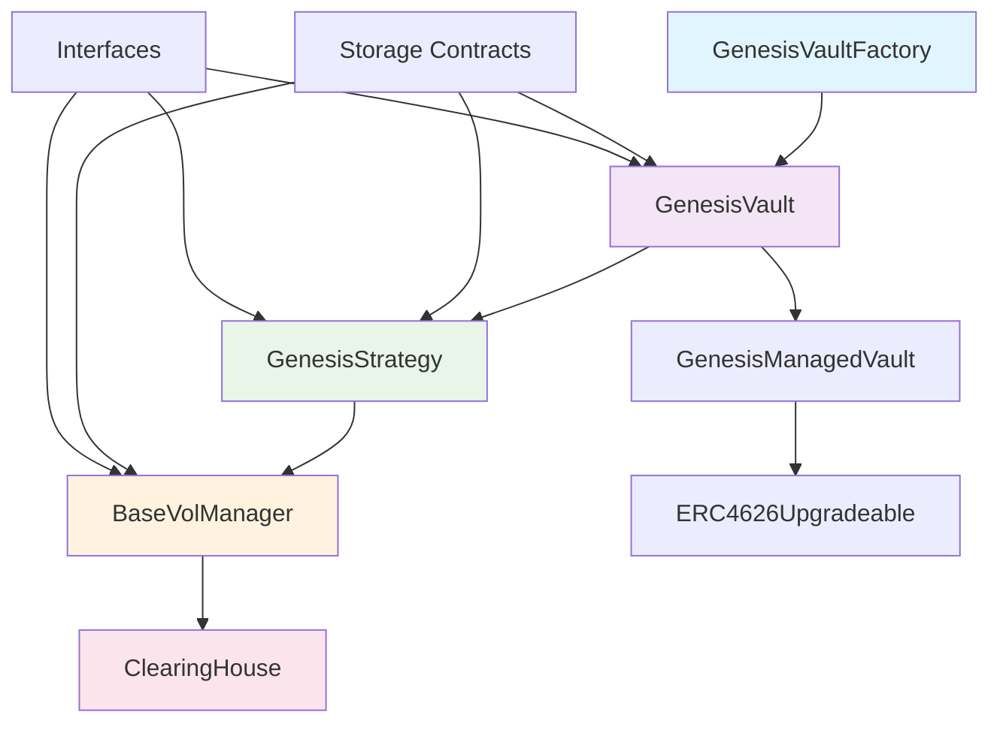
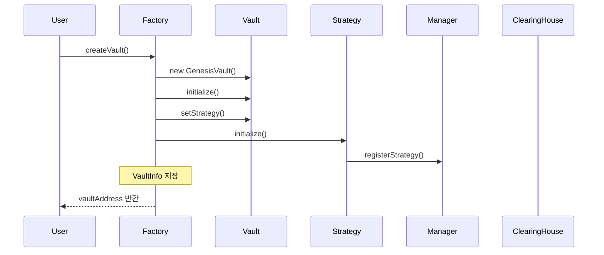
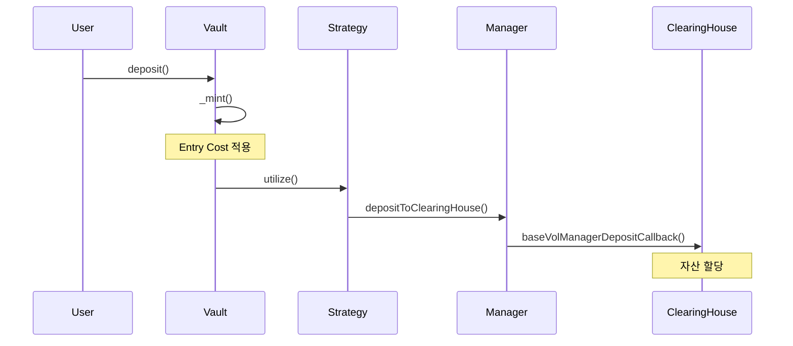
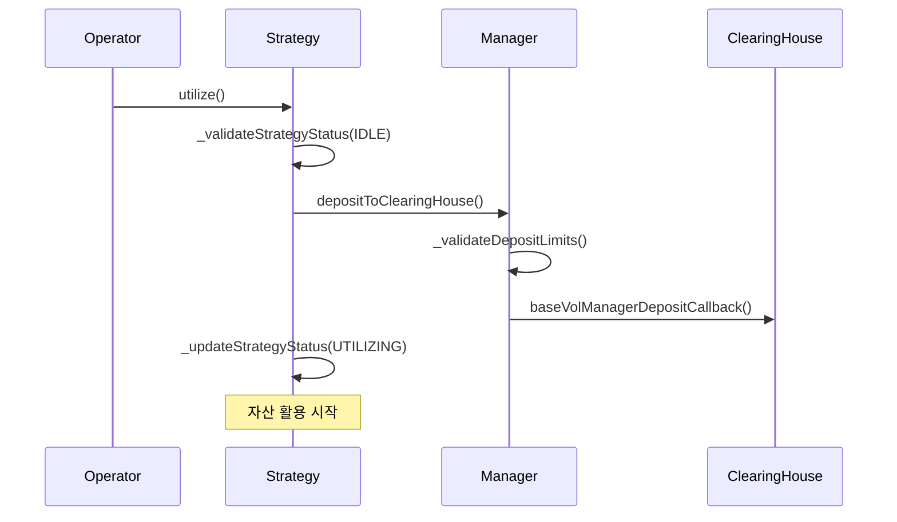
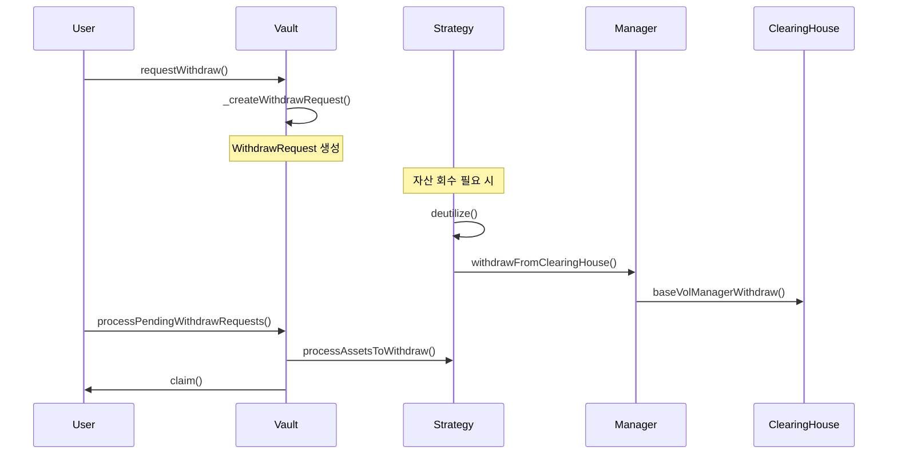
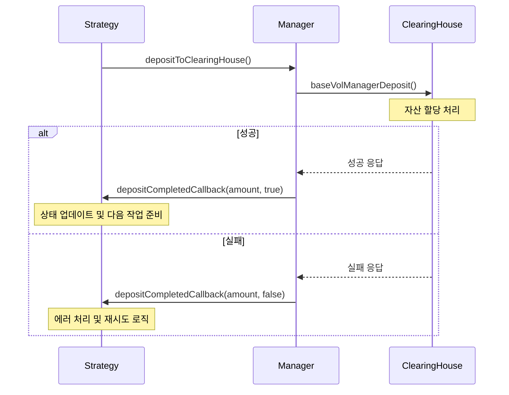
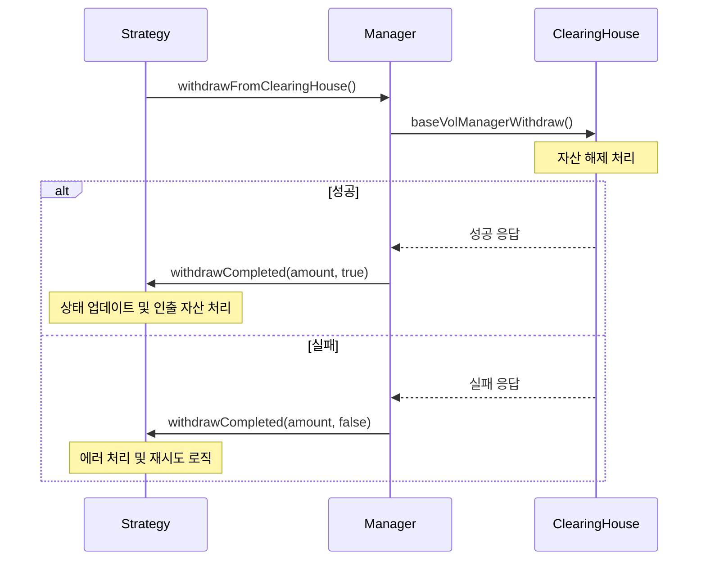

## 1. 전체 아키텍처 개요

현재 시스템은 **DeFi Vault** 구조로 설계되어 있으며, 다음과 같은 계층 구조로 구성됩니다:

```
GenesisVaultFactory → GenesisVault → GenesisStrategy → BaseVolManager → ClearingHouse
```

### 아키텍처 다이어그램



## 2. 각 컨트랙트의 역할과 책임

### GenesisVaultFactory (팩토리 컨트랙트)

**역할**: Vault와 Strategy를 생성하고 관리하는 팩토리

**주요 함수**:

- `createVault()`: 새로운 Vault와 Strategy 쌍을 생성
- `deactivateVault()`: Vault 비활성화
- `getVaultInfo()`: Vault 정보 조회
- `getAllVaults()`: 모든 Vault 목록 조회

**핵심 로직**:

```solidity
function createVault(
    address asset_,
    uint256 entryCost_,
    uint256 exitCost_,
    string calldata name_,
    string calldata symbol_,
    address strategy_
) external returns (address)
```

### GenesisVault (메인 Vault 컨트랙트)

**역할**: ERC4626 표준을 따르는 메인 Vault 컨트랙트

**주요 함수**:

**ERC4626 핵심 함수**:

- `deposit(uint256 assets, address receiver)`: 자산을 예치하고 Vault shares를 받음
- `mint(uint256 shares, address receiver)`: 원하는 shares만큼 자산을 예치
- `withdraw(uint256 assets, address receiver, address owner)`: 자산을 인출 (idle assets가 충분할 때만)
- `redeem(uint256 shares, address receiver, address owner)`: shares를 상환하여 자산 인출 (idle assets가 충분할 때만)

**비동기 인출 함수**:

- `requestWithdraw()`: 비동기 인출 요청 생성
- `requestRedeem()`: 비동기 상환 요청 생성
- `processPendingWithdrawRequests()`: 대기 중인 인출 요청 처리
- `claim()`: 인출 요청 클레임

**관리 함수**:

- `setStrategy()`: 전략 설정
- `setEntryCost()` / `setExitCost()`: 수수료 설정
- `addPrioritizedAccount()` / `removePrioritizedAccount()`: 우선순위 계정 관리

**핵심 특징**:

- Entry/Exit 비용 시스템 (최대 1%)
- 우선순위 계정 관리
- 비동기 인출 처리
- 전략 기반 자산 관리
- ERC4626 표준 완전 준수

### GenesisStrategy (전략 실행 컨트랙트)

**역할**: Vault의 자산을 BaseVol 프로토콜에 투자하는 전략 실행

**주요 함수**:

- `utilize()`: Vault 자산을 ClearingHouse에 투자
- `deutilize()`: ClearingHouse에서 자산을 Vault로 회수
- `processAssetsToWithdraw()`: 인출 자산 처리
- `setOperator()`: 운영자 설정

**전략 상태**:

- `IDLE`: 새로운 작업 가능
- `UTILIZING`: 자산 활용 중
- `DEUTILIZING`: 자산 회수 중

### BaseVolManager (자산 관리 중간자)

**역할**: Strategy와 ClearingHouse 사이의 자산 이동을 관리

**주요 함수**:

- `depositToClearingHouse()`: Strategy에서 ClearingHouse로 자산 이동
- `withdrawFromClearingHouse()`: ClearingHouse에서 Strategy로 자산 회수
- `registerStrategy()`: 전략 등록

### GenesisManagedVault (기본 Vault 기능)

**역할**: Vault의 기본 기능과 수수료 관리

**주요 함수**:

- `setFeeInfos()`: 수수료 정보 설정
- `collectManagementFee()`: 관리 수수료 수취
- `collectPerformanceFee()`: 성과 수수료 수취
- `setDepositLimits()`: 예치 한도 설정

**수수료 시스템**:

- Management Fee: 시간 기반 수수료 (최대 5%)
- Performance Fee: HWM 초과 수익에 대한 수수료 (최대 50%)
- Hurdle Rate: 성과 수수료 적용 기준

## 3. 유기적 동작 흐름

### A. Vault 생성 및 초기화 플로우



### B. 자산 예치 프로세스



### C. 자산 활용 (Utilization) 프로세스



### D. 비동기 인출 프로세스



## 4. 핵심 메커니즘

### A. 수수료 시스템

**Entry Cost**: 예치 시 활용될 자산에만 적용 (최대 1%)

```solidity
uint256 constant MAX_COST = 0.01 ether; // 1%
```

**Exit Cost**: 인출 시 활용된 자산에서만 차감 (최대 1%)

**Management Fee**: 시간 기반 수수료 (최대 5%)

```solidity
uint256 private constant MAX_MANAGEMENT_FEE = 5e16; // 5%
```

**Performance Fee**: HWM 초과 수익에 대한 수수료 (최대 50%)

```solidity
uint256 private constant MAX_PERFORMANCE_FEE = 5e17; // 50%
```

### B. 우선순위 인출 시스템

- `prioritizedAccounts`: 우선순위가 높은 계정들
- 우선순위 계정의 인출 요청이 일반 계정보다 먼저 처리됨
- 메타 Vault나 특별한 계정들을 위한 기능

### C. 전략 상태 관리

```solidity
enum StrategyStatus {
    IDLE,           // 새로운 작업 가능
    UTILIZING,      // 자산 활용 중
    DEUTILIZING,    // 자산 회수 중
}
```

## 5. 보안 및 안전장치

### A. 접근 제어

- `onlyOwner`: Vault 소유자만 호출 가능
- `onlyAdmin`: 관리자만 호출 가능
- `onlyOwnerOrVault`: 소유자 또는 Vault만 호출 가능
- `authCaller`: 인증된 호출자만 호출 가능

### B. 일시정지 및 종료

- `pause()`: 긴급 상황 시 일시정지
- `shutdown()`: Vault 완전 종료 (인출만 가능)
- `stop()`: Strategy 중지 및 자산 회수

### C. 재진입 공격 방지

- `nonReentrant` 모디파이어 사용
- 상태 기반 접근 제어
- `ReentrancyGuardUpgradeable` 상속

## 6. 성능 최적화

### A. 가스 효율성

- Storage 패턴을 통한 가스 최적화
- 배치 처리로 여러 작업을 한 번에 처리
- 불필요한 상태 변경 최소화

### B. 확장성

- 모듈화된 설계로 새로운 전략 추가 용이
- Factory 패턴으로 다중 Vault 지원
- 설정 가능한 파라미터로 유연한 운영

## 7. 코드 구조 분석

### 주요 상수 및 제한사항

```solidity
// GenesisVault
uint256 constant MAX_COST = 0.01 ether; // 1%

// GenesisManagedVault
uint256 private constant MAX_MANAGEMENT_FEE = 5e16; // 5%
uint256 private constant MAX_PERFORMANCE_FEE = 5e17; // 50%

// BaseVolManager
uint256 $.maxStrategyDeposit = 1000000e6; // 1M USDC
uint256 $.minStrategyDeposit = 10e6; // 10 USDC
uint256 $.maxTotalExposure = 10000000e6; // 10M USDC
```

### 핵심 함수들

**GenesisVault (ERC4626 표준)**:

- `deposit()`: 자산 예치 및 shares 발행
- `mint()`: 원하는 shares만큼 자산 예치
- `withdraw()`: 자산 인출 (idle assets 충분 시)
- `redeem()`: shares 상환 (idle assets 충분 시)

**GenesisVault (비동기 인출)**:

- `requestWithdraw()`: 비동기 인출 요청
- `requestRedeem()`: 비동기 상환 요청
- `processPendingWithdrawRequests()`: 인출 요청 처리
- `claim()`: 인출 요청 클레임

**GenesisStrategy**:

- `utilize()`: 자산 활용
- `deutilize()`: 자산 회수
- `processAssetsToWithdraw()`: 인출 자산 처리

**BaseVolManager**:

- `depositToClearingHouse()`: ClearingHouse 예치
- `withdrawFromClearingHouse()`: ClearingHouse 인출
- `rebalanceAssets()`: 자산 리밸런싱

## 8. 콜백 함수 시스템

### A. 콜백 함수 개요

시스템 내에서 다양한 컨트랙트 간의 상호작용을 위해 콜백 함수들이 사용됩니다. 이는 비동기 작업의 완료 상태를 전달하고, 각 계층에서 적절한 후속 처리를 수행할 수 있도록 합니다.

### B. Strategy 콜백 함수들

#### depositCompletedCallback

**위치**: `IGenesisStrategy.depositCompletedCallback()`

**호출 시점**: BaseVolManager에서 ClearingHouse 예치 완료 후

**파라미터**:

- `amount`: 예치된 자산의 양
- `success`: 예치 성공 여부 (true/false)

**역할**:

- 전략에 예치 작업의 완료 상태를 알림
- 성공 시: 전략의 상태를 업데이트하고 다음 작업 준비
- 실패 시: 에러 처리 및 재시도 로직 실행

**사용 예시**:

```solidity
// BaseVolManager.sol에서 호출
IGenesisStrategy(strategy).depositCompletedCallback(amount, true);
```

#### withdrawCompletedCallback

**위치**: `IGenesisStrategy.withdrawCompletedCallback()`

**호출 시점**: BaseVolManager에서 ClearingHouse 인출 완료 후

**파라미터**:

- `amount`: 인출된 자산의 양
- `success`: 인출 성공 여부 (true/false)

**역할**:

- 전략에 인출 작업의 완료 상태를 알림
- 성공 시: 전략의 상태를 업데이트하고 인출된 자산 처리
- 실패 시: 에러 처리 및 재시도 로직 실행

**사용 예시**:

```solidity
// BaseVolManager.sol에서 호출
IGenesisStrategy(strategy).withdrawCompletedCallback(amount, true);
```

### C. ClearingHouse 콜백 함수들

#### baseVolManagerDepositCallback

**위치**: `IClearingHouse.baseVolManagerDepositCallback()`

**호출 시점**: BaseVolManager에서 ClearingHouse에 자산 예치 시

**파라미터**:

- `amount`: 예치할 자산의 양

**역할**:

- ClearingHouse에서 BaseVolManager의 예치 요청을 처리
- 자산 할당 및 잔액 업데이트
- 예치 성공/실패에 따른 응답 반환

**사용 예시**:

```solidity
// BaseVolManager.sol에서 호출
$.clearingHouse.baseVolManagerDepositCallback(amount);
```

#### baseVolManagerWithdraw

**위치**: `IClearingHouse.baseVolManagerWithdraw()`

**호출 시점**: BaseVolManager에서 ClearingHouse에서 자산 인출 시

**파라미터**:

- `amount`: 인출할 자산의 양

**역할**:

- ClearingHouse에서 BaseVolManager의 인출 요청을 처리
- 자산 해제 및 잔액 업데이트
- 인출 성공/실패에 따른 응답 반환

**사용 예시**:

```solidity
// BaseVolManager.sol에서 호출
$.clearingHouse.baseVolManagerWithdraw(amount);
```

### D. 콜백 함수 호출 흐름

#### 예치 프로세스 콜백 흐름



#### 인출 프로세스 콜백 흐름



### E. 콜백 함수의 장점

1. **비동기 처리**: 긴 시간이 걸리는 작업의 완료를 기다리지 않고 다른 작업 수행 가능
2. **상태 동기화**: 각 계층에서 작업 완료 상태를 정확히 파악하여 상태 일관성 유지
3. **에러 처리**: 실패 시 적절한 에러 처리 및 복구 로직 실행
4. **확장성**: 새로운 전략이나 기능 추가 시 콜백 인터페이스만 구현하면 됨

### F. 콜백 함수 구현 시 주의사항

1. **재진입 공격 방지**: `nonReentrant` 모디파이어 사용
2. **가스 한도 고려**: 콜백 함수 내에서 복잡한 로직 실행 시 가스 한도 초과 가능성
3. **에러 전파**: 콜백 함수에서 발생한 에러가 상위 계층으로 전파되지 않도록 처리
4. **상태 일관성**: 콜백 함수 실행 전후로 상태가 일관되게 유지되는지 확인
