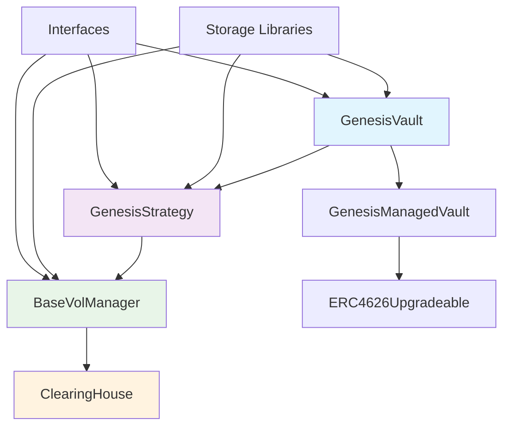
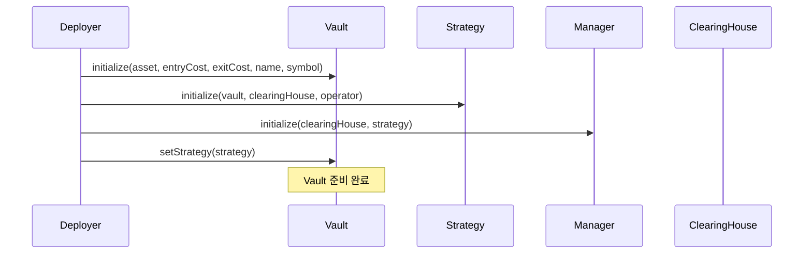
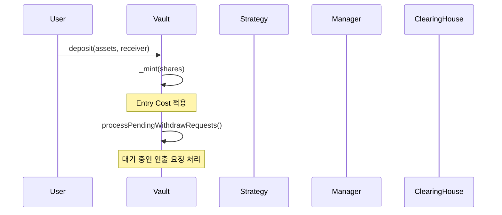
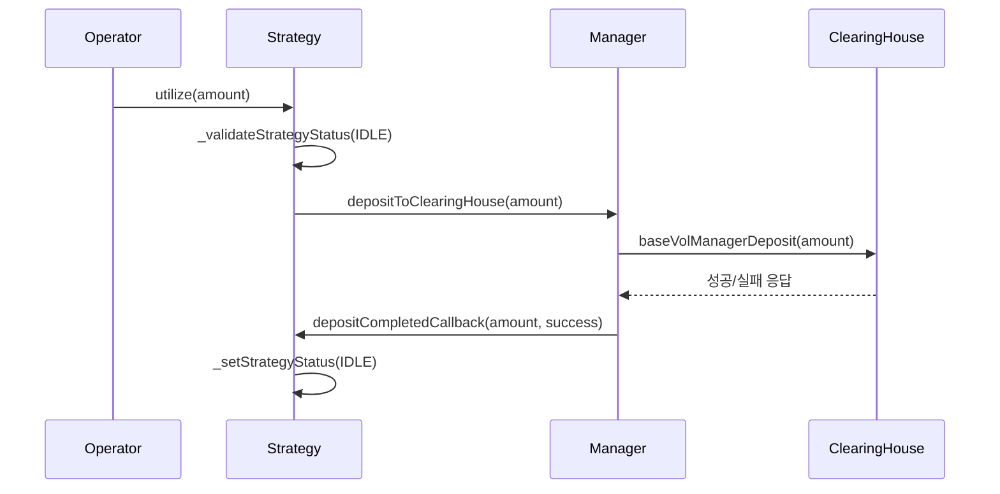
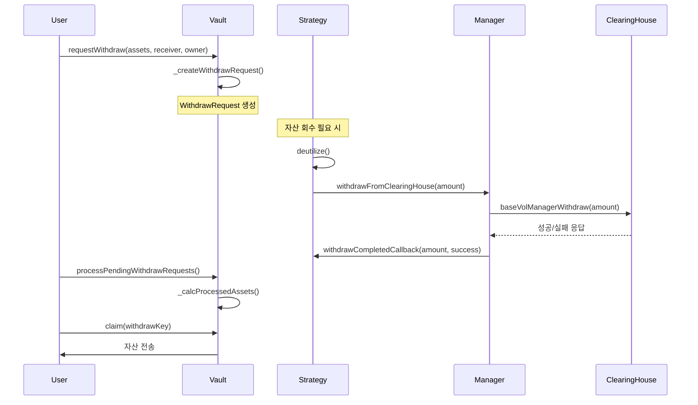
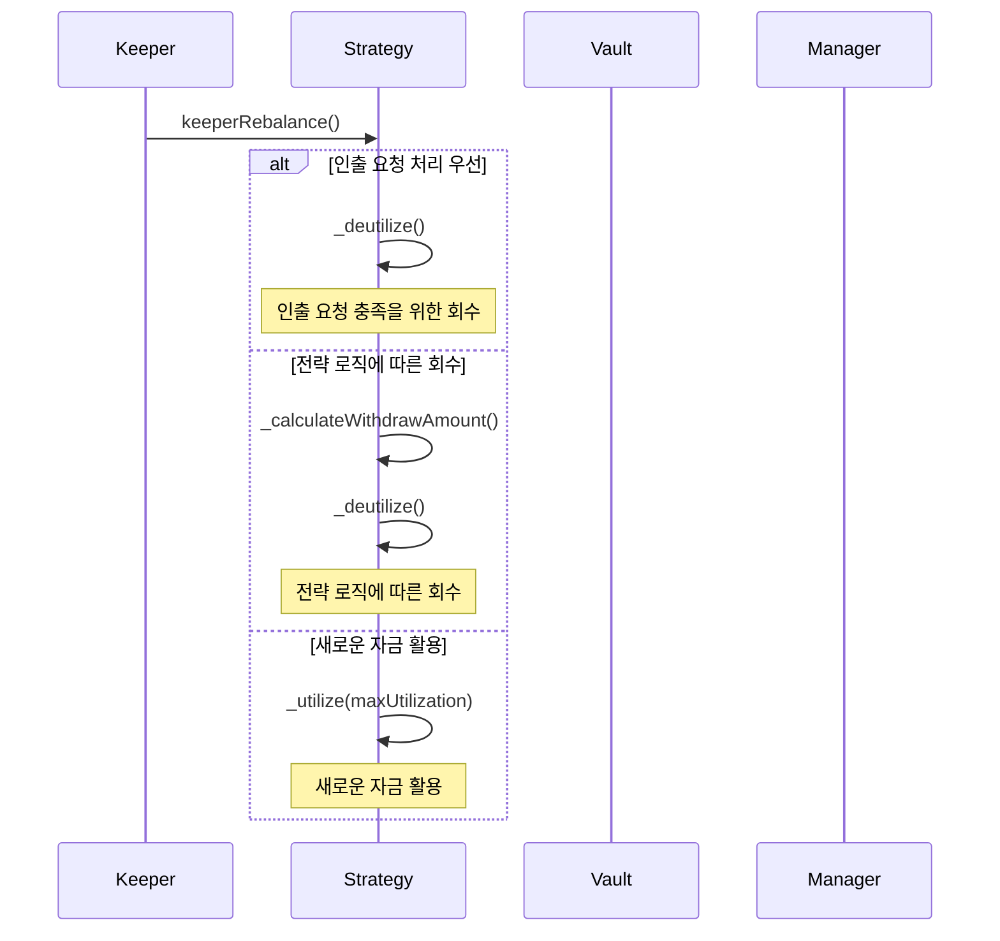
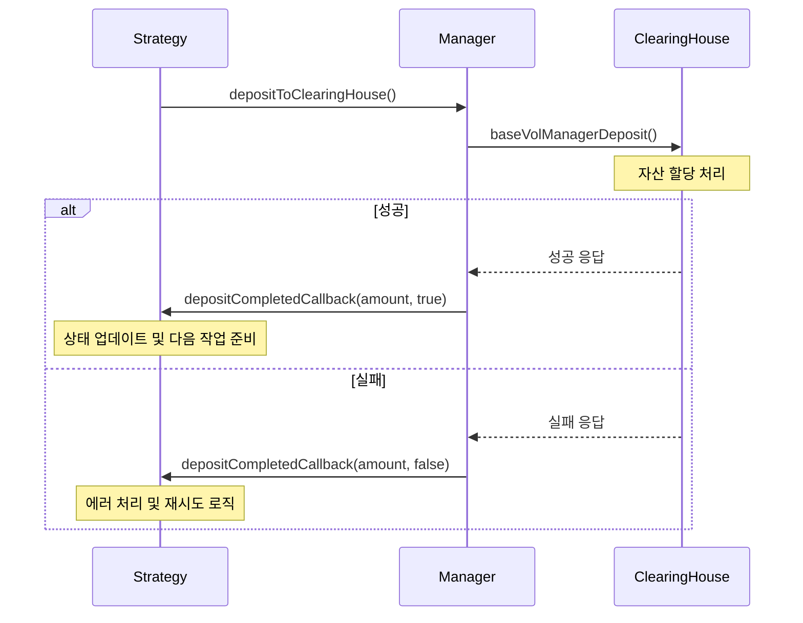
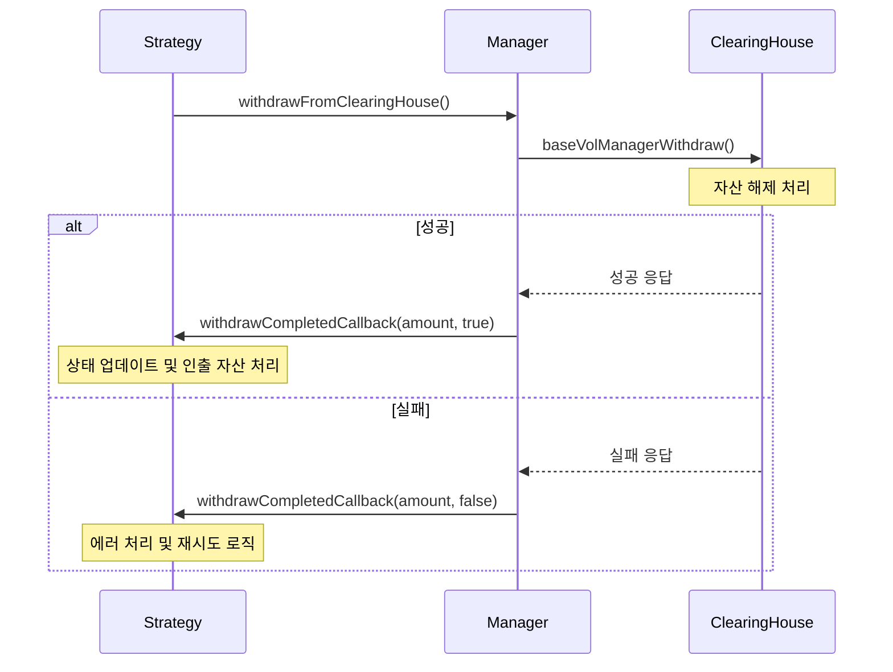

# Genesis Vault 시스템 아키텍처 문서

## 1. 전체 아키텍처 개요

Genesis Vault 시스템은 **ERC4626 표준을 준수하는 DeFi Vault** 구조로 설계되어 있으며, 다음과 같은 계층 구조로 구성됩니다:

```
GenesisVault → GenesisStrategy → BaseVolManager → ClearingHouse
```

### 아키텍처 다이어그램



## 2. 각 컨트랙트의 역할과 책임

### GenesisVault (메인 Vault 컨트랙트)

**역할**: ERC4626 표준을 따르는 메인 Vault 컨트랙트

**주요 특징**:

- ERC4626 표준 완전 준수
- Entry/Exit 비용 시스템 (최대 10%)
- 우선순위 계정 관리
- 비동기 인출 처리
- 전략 기반 자산 관리

**핵심 함수**:

**ERC4626 표준 함수**:

- `deposit(uint256 assets, address receiver)`: 자산을 예치하고 Vault shares를 받음
- `mint(uint256 shares, address receiver)`: 원하는 shares만큼 자산을 예치
- `withdraw(uint256 assets, address receiver, address owner)`: 자산을 인출 (idle assets가 충분할 때만)
- `redeem(uint256 shares, address receiver, address owner)`: shares를 상환하여 자산 인출 (idle assets가 충분할 때만)

**비동기 인출 함수**:

- `requestWithdraw()`: 비동기 인출 요청 생성
- `requestRedeem()`: 비동기 상환 요청 생성
- `processPendingWithdrawRequests()`: 대기 중인 인출 요청 처리
- `claim()`: 인출 요청 클레임

**관리 함수**:

- `setStrategy()`: 전략 설정
- `setEntryAndExitCost()`: 수수료 설정
- `addPrioritizedAccount()` / `removePrioritizedAccount()`: 우선순위 계정 관리
- `shutdown()`: Vault 종료
- `pause()` / `unpause()`: 일시정지/재개

### GenesisStrategy (전략 실행 컨트랙트)

**역할**: Vault의 자산을 BaseVol 프로토콜에 투자하는 전략 실행

**주요 함수**:

- `utilize(uint256 amount)`: Vault 자산을 ClearingHouse에 투자
- `deutilize()`: ClearingHouse에서 자산을 Vault로 회수
- `processAssetsToWithdraw()`: 인출 자산 처리
- `keeperRebalance()`: 자동 리밸런싱 (운영자 전용)
- `setOperator()`: 운영자 설정

**전략 상태**:

```solidity
enum StrategyStatus {
    IDLE,           // 새로운 작업 가능
    UTILIZING,      // 자산 활용 중
    DEUTILIZING,    // 자산 회수 중
    EMERGENCY       // 긴급 상황
}
```

**콜백 함수**:

- `depositCompletedCallback(uint256 amount, bool success)`: 예치 완료 콜백
- `withdrawCompletedCallback(uint256 amount, bool success)`: 인출 완료 콜백

### BaseVolManager (자산 관리 중간자)

**역할**: Strategy와 ClearingHouse 사이의 자산 이동을 관리

**주요 함수**:

- `depositToClearingHouse(uint256 amount)`: Strategy에서 ClearingHouse로 자산 이동
- `withdrawFromClearingHouse(uint256 amount)`: ClearingHouse에서 Strategy로 자산 회수
- `emergencyWithdraw(uint256 amount)`: 긴급 인출 (소유자 전용)

**설정 관리**:

- `setConfig()`: 최대/최소 예치 한도, 총 노출 한도 설정
- `setClearingHouse()`: ClearingHouse 주소 변경

### GenesisManagedVault (기본 Vault 기능)

**역할**: Vault의 기본 기능과 수수료 관리

**주요 함수**:

- `setFeeInfos()`: 수수료 정보 설정
- `accrueManagementFeeShares()`: 관리 수수료 수취
- `setDepositLimits()`: 예치 한도 설정

**수수료 시스템**:

- Management Fee: 시간 기반 수수료 (최대 5%)
- Performance Fee: HWM 초과 수익에 대한 수수료 (최대 50%)
- Hurdle Rate: 성과 수수료 적용 기준

## 3. 유기적 동작 흐름

### A. Vault 초기화 플로우



### B. 자산 예치 프로세스



### C. 자산 활용 (Utilization) 프로세스



### D. 비동기 인출 프로세스



### E. Keeper 리밸런싱 프로세스



## 4. 핵심 메커니즘

### A. 수수료 시스템

**Entry Cost**: 예치 시 활용될 자산에만 적용 (최대 10%)

```solidity
uint256 constant MAX_COST = 0.10 ether; // 10%
```

**Exit Cost**: 인출 시 활용된 자산에서만 차감 (최대 10%)

**Management Fee**: 시간 기반 수수료 (최대 5%)

```solidity
uint256 private constant MAX_MANAGEMENT_FEE = 5e16; // 5%
```

**Performance Fee**: HWM 초과 수익에 대한 수수료 (최대 50%)

```solidity
uint256 private constant MAX_PERFORMANCE_FEE = 5e17; // 50%
```

### B. 우선순위 인출 시스템

- `prioritizedAccounts`: 우선순위가 높은 계정들
- 우선순위 계정의 인출 요청이 일반 계정보다 먼저 처리됨
- 메타 Vault나 특별한 계정들을 위한 기능

### C. 전략 상태 관리

```solidity
enum StrategyStatus {
    IDLE,           // 새로운 작업 가능
    UTILIZING,      // 자산 활용 중
    DEUTILIZING,    // 자산 회수 중
    EMERGENCY       // 긴급 상황 (30% 이상 손실 시)
}
```

### D. 손실 감지 및 긴급 처리

- 30% 이상 손실 시 `EMERGENCY` 상태로 전환
- 긴급 상황에서는 모든 자산을 회수
- 손실 통계 추적 및 이벤트 발생

## 5. 보안 및 안전장치

### A. 접근 제어

- `onlyOwner`: Vault 소유자만 호출 가능
- `onlyAdmin`: 관리자만 호출 가능
- `onlyOwnerOrVault`: 소유자 또는 Vault만 호출 가능
- `authCaller`: 인증된 호출자만 호출 가능

### B. 일시정지 및 종료

- `pause()`: 긴급 상황 시 일시정지
- `shutdown()`: Vault 완전 종료 (인출만 가능)
- `stop()`: Strategy 중지 및 자산 회수

### C. 재진입 공격 방지

- `nonReentrant` 모디파이어 사용
- 상태 기반 접근 제어
- `ReentrancyGuardUpgradeable` 상속

### D. 업그레이드 가능성

- UUPS (Universal Upgradeable Proxy Standard) 패턴 사용
- `_authorizeUpgrade()` 함수로 업그레이드 권한 제어

## 6. 성능 최적화

### A. 가스 효율성

- Storage 패턴을 통한 가스 최적화
- 배치 처리로 여러 작업을 한 번에 처리
- 불필요한 상태 변경 최소화

### B. 확장성

- 모듈화된 설계로 새로운 전략 추가 용이
- 설정 가능한 파라미터로 유연한 운영
- 인터페이스 기반 설계로 확장성 보장

## 7. 코드 구조 분석

### 주요 상수 및 제한사항

```solidity
// GenesisVault
uint256 constant MAX_COST = 0.10 ether; // 10%

// GenesisManagedVault
uint256 private constant MAX_MANAGEMENT_FEE = 5e16; // 5%
uint256 private constant MAX_PERFORMANCE_FEE = 5e17; // 50%

// BaseVolManager
uint256 $.maxStrategyDeposit = 1000000e6; // 1M USDC
uint256 $.minStrategyDeposit = 10e6; // 10 USDC
uint256 $.maxTotalExposure = 10000000e6; // 10M USDC
```

### 핵심 함수들

**GenesisVault (ERC4626 표준)**:

- `deposit()`: 자산 예치 및 shares 발행
- `mint()`: 원하는 shares만큼 자산 예치
- `withdraw()`: 자산 인출 (idle assets 충분 시)
- `redeem()`: shares 상환 (idle assets 충분 시)

**GenesisVault (비동기 인출)**:

- `requestWithdraw()`: 비동기 인출 요청
- `requestRedeem()`: 비동기 상환 요청
- `processPendingWithdrawRequests()`: 인출 요청 처리
- `claim()`: 인출 요청 클레임

**GenesisStrategy**:

- `utilize()`: 자산 활용
- `deutilize()`: 자산 회수
- `keeperRebalance()`: 자동 리밸런싱
- `processAssetsToWithdraw()`: 인출 자산 처리

**BaseVolManager**:

- `depositToClearingHouse()`: ClearingHouse 예치
- `withdrawFromClearingHouse()`: ClearingHouse 인출
- `emergencyWithdraw()`: 긴급 인출

## 8. 콜백 함수 시스템

### A. 콜백 함수 개요

시스템 내에서 다양한 컨트랙트 간의 상호작용을 위해 콜백 함수들이 사용됩니다. 이는 비동기 작업의 완료 상태를 전달하고, 각 계층에서 적절한 후속 처리를 수행할 수 있도록 합니다.

### B. Strategy 콜백 함수들

#### depositCompletedCallback

**위치**: `IGenesisStrategy.depositCompletedCallback()`

**호출 시점**: BaseVolManager에서 ClearingHouse 예치 완료 후

**파라미터**:

- `amount`: 예치된 자산의 양
- `success`: 예치 성공 여부 (true/false)

**역할**:

- 전략에 예치 작업의 완료 상태를 알림
- 성공 시: 전략의 상태를 업데이트하고 다음 작업 준비
- 실패 시: 에러 처리 및 재시도 로직 실행

#### withdrawCompletedCallback

**위치**: `IGenesisStrategy.withdrawCompletedCallback()`

**호출 시점**: BaseVolManager에서 ClearingHouse 인출 완료 후

**파라미터**:

- `amount`: 인출된 자산의 양
- `success`: 인출 성공 여부 (true/false)

**역할**:

- 전략에 인출 작업의 완료 상태를 알림
- 성공 시: 전략의 상태를 업데이트하고 인출된 자산 처리
- 실패 시: 에러 처리 및 재시도 로직 실행

### C. 콜백 함수 호출 흐름

#### 예치 프로세스 콜백 흐름



#### 인출 프로세스 콜백 흐름



### D. 콜백 함수의 장점

1. **비동기 처리**: 긴 시간이 걸리는 작업의 완료를 기다리지 않고 다른 작업 수행 가능
2. **상태 동기화**: 각 계층에서 작업 완료 상태를 정확히 파악하여 상태 일관성 유지
3. **에러 처리**: 실패 시 적절한 에러 처리 및 복구 로직 실행
4. **확장성**: 새로운 전략이나 기능 추가 시 콜백 인터페이스만 구현하면 됨

### E. 콜백 함수 구현 시 주의사항

1. **재진입 공격 방지**: `nonReentrant` 모디파이어 사용
2. **가스 한도 고려**: 콜백 함수 내에서 복잡한 로직 실행 시 가스 한도 초과 가능성
3. **에러 전파**: 콜백 함수에서 발생한 에러가 상위 계층으로 전파되지 않도록 처리
4. **상태 일관성**: 콜백 함수 실행 전후로 상태가 일관되게 유지되는지 확인

## 9. 배포 및 설정

### A. 배포 순서

1. **GenesisVault 배포**

   ```typescript
   const genesisVault = await upgrades.deployProxy(GenesisVaultFactory, [
     usdcAddress, // asset
     ethers.parseEther("0.01"), // entryCost (1%)
     ethers.parseEther("0.01"), // exitCost (1%)
     "Genesis Vault", // name
     "gVAULT", // symbol
   ]);
   ```

2. **GenesisStrategy 배포**

   ```typescript
   const strategy = await upgrades.deployProxy(StrategyFactory, [
     genesisVaultAddress, // vault
     clearingHouseAddress, // clearingHouse
     operatorAddress, // operator
   ]);
   ```

3. **BaseVolManager 배포**

   ```typescript
   const manager = await upgrades.deployProxy(ManagerFactory, [
     clearingHouseAddress, // clearingHouse
     strategyAddress, // strategy
   ]);
   ```

4. **전략 설정**
   ```typescript
   await genesisVault.setStrategy(strategyAddress);
   await strategy.setBaseVolManager(managerAddress);
   ```

### B. 초기 설정

- Entry/Exit Cost: 1% (최대 10%)
- Management Fee: 0% (최대 5%)
- Performance Fee: 0% (최대 50%)
- Max Utilize Percentage: 100%

## 10. 모니터링 및 메트릭스

### A. 주요 메트릭스

**Vault 메트릭스**:

- Total Assets: 총 자산
- Total Supply: 총 공급량
- Idle Assets: 유휴 자산
- Pending Withdraw: 대기 중인 인출

**Strategy 메트릭스**:

- Utilized Assets: 활용된 자산
- Strategy Balance: 전략 잔액
- PnL Information: 손익 정보
- Strategy Status: 전략 상태

**Performance 메트릭스**:

- Management Fee Collected: 수취된 관리 수수료
- Performance Fee Collected: 수취된 성과 수수료
- High Water Mark: 고점 기준

### B. 이벤트 모니터링

**Vault 이벤트**:

- `WithdrawRequested`: 인출 요청
- `Claimed`: 인출 클레임
- `VaultState`: Vault 상태 변경

**Strategy 이벤트**:

- `Utilize`: 자산 활용
- `Deutilize`: 자산 회수
- `LossDetected`: 손실 감지
- `KeeperAction`: Keeper 액션

**Manager 이벤트**:

- `DepositedToClearingHouse`: ClearingHouse 예치
- `WithdrawnFromClearingHouse`: ClearingHouse 인출

## 11. 보안 고려사항

### A. 스마트 컨트랙트 보안

1. **재진입 공격 방지**: 모든 외부 호출 후 상태 변경
2. **오버플로우/언더플로우 방지**: Solidity 0.8+ 자동 체크
3. **접근 제어**: 적절한 권한 관리
4. **업그레이드 보안**: UUPS 패턴 사용

### B. 운영 보안

1. **멀티시그**: 중요한 함수에 멀티시그 적용
2. **타임락**: 중요한 설정 변경에 지연 시간 적용
3. **모니터링**: 실시간 모니터링 및 알림
4. **긴급 대응**: 일시정지 및 긴급 인출 기능

### C. 경제적 보안

1. **수수료 한도**: 최대 수수료 제한
2. **손실 한도**: 최대 손실 허용 범위
3. **유동성 관리**: 충분한 유동성 유지
4. **리스크 관리**: 다양한 리스크 시나리오 대비

## 12. 향후 개선 사항

### A. 기능 개선

1. **다중 전략 지원**: 여러 전략을 동시에 운영
2. **자동 리밸런싱**: 더 정교한 자동 리밸런싱 로직
3. **가격 오라클 통합**: 실시간 가격 정보 활용
4. **보험 통합**: DeFi 보험 프로토콜과 연동

### B. 성능 개선

1. **가스 최적화**: 더 효율적인 가스 사용
2. **배치 처리**: 여러 작업을 한 번에 처리
3. **캐싱**: 자주 사용되는 데이터 캐싱
4. **병렬 처리**: 가능한 작업의 병렬 처리

### C. 사용자 경험 개선

1. **프론트엔드**: 직관적인 사용자 인터페이스
2. **모바일 지원**: 모바일 앱 개발
3. **알림 시스템**: 실시간 알림 및 업데이트
4. **문서화**: 상세한 사용자 가이드

---

이 문서는 Genesis Vault 시스템의 현재 구현을 기반으로 작성되었으며, 시스템의 이해와 유지보수를 위한 참고 자료로 사용됩니다.
